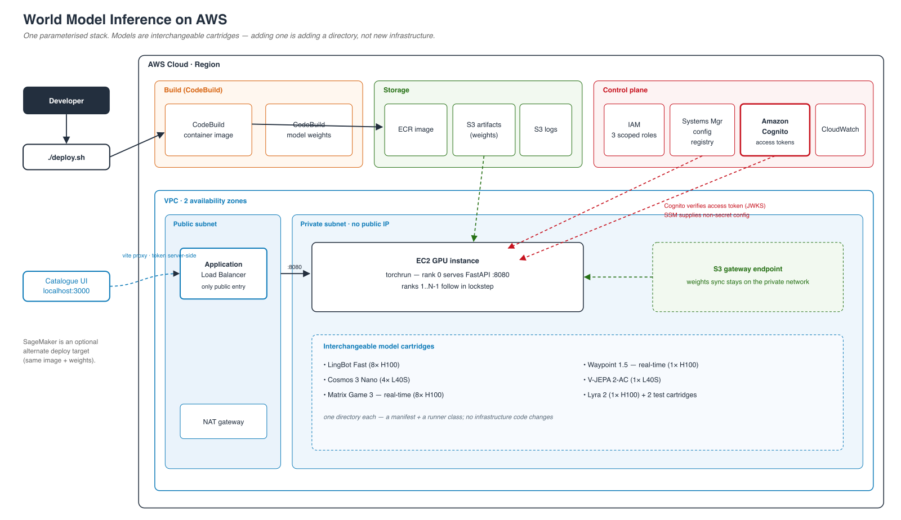

# Architecture



The PNG above is rendered from [`diagrams/architecture-v1-cartridge-platform.svg`](diagrams/architecture-v1-cartridge-platform.svg); [`diagrams/architecture-v1-cartridge-platform.drawio`](diagrams/architecture-v1-cartridge-platform.drawio) is the draw.io editable source
(open at [app.diagrams.net](https://app.diagrams.net) or with the VS Code draw.io
extension).

The infrastructure is **one parameterised CDK stack**, identical for every model —
only the instance type, volume size and serving mode change. That is the point of
the repo: adding a model means adding a directory under `inference/models/`, not
writing new infrastructure.

## Stacks

Two stack classes, three solution-tracking tags:

| Stack | Class | When | Contents |
|---|---|---|---|
| `WorldModelFoundation` | `SharedStack` | Always, once per account/region | VPC (2 AZ, NAT, S3 gateway endpoint), 3 S3 buckets, 3 scoped IAM roles, 2 CodeBuild projects, SSM registry |
| `WorldModel-<name>` | `ModelStack` | Per deployment | EC2: ALB + target group + ASG(1) + launch template. SageMaker: Model + EndpointConfig + Endpoint |

`ModelStack` reads the foundation's outputs from SSM at synth time, so the two
stacks stay independent and a model can be destroyed without touching shared infra.

## Build

`./deploy.sh` first probes ECR for an existing image tag and skips the build if one
is present (`REBUILD_IMAGE=1` forces it). Otherwise it zips `inference/`, uploads it
to `s3://<artifacts>/_builds/<id>/source.zip` and runs the `world-model-image`
CodeBuild project, which builds the container and pushes it to ECR. A `:buildcache`
tag is pulled as a cache source and pushed back, so unchanged early layers — base
image, deps, slow CUDA compiles — are cache hits.

Weights are staged separately and **once per model** by the `world-model-weights`
project: it downloads from Hugging Face and `aws s3 sync`s to the artifacts bucket.
That project runs on `X2_LARGE` with a 4-hour timeout because `hf download` keeps a
copy in the HF cache *and* the target directory, so peak disk is roughly twice the
repo size.

Before launching anything, `deploy.sh` re-probes ECR and **aborts if no image
exists**. A GPU instance whose `docker pull` fails still bills at up to ~$55/hr, so
this guard matters.

## Serve

CDK deploys a two-AZ VPC (`maxAzs: 2`, one NAT gateway).

The **Application Load Balancer** sits in the public subnet and is the only public
entry. It forwards `:8080` to a target group health-checked on `/health` (30s
interval, 2 healthy / 3 unhealthy). Ingress is restricted to `allowedCidr` — which
`deploy.sh` defaults to your own public IP `/32`. With `CERTIFICATE_ARN` set it
serves HTTPS on 443 and redirects 80 → 443; without one it is plain HTTP.

The **GPU instance** runs in a private subnet with no public IP, in an Auto Scaling
group pinned to `min = max = desired = 1` — this is not an elastic fleet. Its AMI is
resolved from a public SSM parameter at deploy time rather than a credentialed
lookup, so synth works offline.

At boot the instance:

1. logs to `/var/log/world-model-startup.log`
2. authenticates to ECR and `docker pull`s its image
3. symlinks `/opt/checkpoints` onto instance NVMe when present
4. `aws s3 sync`s weights from the artifacts bucket over the **S3 gateway endpoint**
5. receives its Cognito settings (user pool ID, client IDs, scope — all non-secret)
   as container env; the app verifies pool-issued access tokens against the pool's JWKS
6. `docker run --gpus all --net host --ipc host -v $CKPT_DIR:/opt/ml/model`

## Run

The container entrypoint `inference/lib/serve` starts `torchrun` with one process
per detected GPU:

```
EC2 instance
┌──────────────────────────────────────────────────┐
│ torchrun --nproc_per_node=<detected GPUs>        │
│                                                  │
│  rank 0      FastAPI :8080 + job queue           │
│              └─ dist.broadcast_object_list ──┐   │
│  ranks 1..N-1  follower_loop  ◀──────────────┘   │
│                                                  │
│  every GPU runs the same step in lockstep        │
└──────────────────────────────────────────────────┘
```

`runner.setup()` is called on every rank. Rank 0 then serves the FastAPI app and an
**in-memory** job store (a restart loses queued jobs — there is no DynamoDB); the
other ranks block in `follower_loop` until commanded.

**Async cartridges** accept `POST /generate`, which enqueues a job and returns a
`job_id`. A worker thread drains the queue, broadcasts `CMD_GENERATE` to every rank,
and all GPUs run `generate()` together. Clients poll `GET /jobs/{id}` then fetch
`GET /jobs/{id}/output`. Job states: `queued → running → complete | failed`.

**Real-time cartridges** hold a WebSocket open on `/ws`. Auth is checked *before*
`ws.accept()` (the token arrives as `?token=`, since WebSocket has no Authorization
header; failure closes with 1008). Two asyncio tasks then run concurrently: one
reads client actions into an `ActionBuffer` (latest-action-wins, decoupling input
rate from GPU rate), the other drains `runner.stream()` back to the client. There is
no job queue on this path.

### Routes

| Route | Purpose |
|---|---|
| `GET /ping`, `GET /health` | Health checks; `/health` reports world size and GPU count |
| `POST /generate` | Async job submission (multipart) |
| `GET /jobs/{id}`, `GET /status/{id}` | Job status |
| `GET /jobs/{id}/output`, `GET /result/{id}` | Fetch result |
| `POST /invocations` | SageMaker sync contract |
| `WS /ws`, `WS /invocations-bidirectional-stream` | Real-time streaming |

Middleware order is headers → CORS → rate limit → auth. See
[Security](SECURITY.md).

## Elsewhere

The **catalogue UI** runs locally: `./deploy.sh ui` starts vite on `:3000` and
proxies the API paths to the ALB, injecting a Cognito access token **server-side**. The
browser only ever talks to localhost, so there is no CORS problem and the token
never reaches the JS bundle. There is no hosted UI — nothing serves the SPA from
AWS.

Passing `sagemaker` as the deploy target provisions a SageMaker endpoint from the
same image and weights instead of EC2. Async models get an
`asyncInferenceConfig` writing to the outputs bucket. SageMaker endpoints are
IAM-authenticated (`sagemaker:InvokeEndpoint`), so the Cognito check is defence in
depth there; the same non-secret `WORLD_MODEL_COGNITO_*` settings are passed as
container environment.

## Project layout

```
world-model-inference/
├── deploy.sh                     # ⭐ single entry point — wraps CDK
├── scripts/
│   ├── build-image.py            # CodeBuild container builds
│   └── stage-weights.py          # Hugging Face → S3 weight staging
├── inference/
│   ├── Dockerfile.default        # shared image build (see ADDING_A_MODEL.md)
│   ├── lib/                      # serving framework — you never write a server
│   │   ├── serve                 # entrypoint → torchrun -m lib.serve
│   │   ├── app.py                # FastAPI app + routes
│   │   ├── distributed.py        # rank-0 broadcast / follower loop
│   │   ├── jobs.py, runner.py    # job queue + Runner base class
│   │   └── security.py           # auth / CORS / rate limit / headers
│   └── models/
│       ├── <id>/                 # one directory per cartridge
│       │   ├── endpoint.yaml     # instance types, weights, build tuning
│       │   ├── runner.py         # subclasses Runner
│       │   └── requirements.txt
│       └── _template/            # 📋 copy me to add a model
├── cdk/
│   ├── bin/app.ts                # stack instantiation
│   └── lib/
│       ├── shared.ts             # WorldModelFoundation
│       ├── model.ts              # WorldModel-<name>
│       ├── solution.ts           # solution tracking code
│       └── constructs/           # ec2.ts, sagemaker.ts, manifest.ts
├── frontend/                     # catalogue UI (React + Vite + Tailwind)
├── tests/
└── docs/
```

## What this architecture does not include

Worth stating explicitly, since diagrams of similar systems often show them: there
is **no** Cognito, DynamoDB, SQS, SNS, EventBridge, Step Functions, API Gateway,
Lambda, or CloudFront anywhere in this stack. The job queue is in-memory, the ASG is
a single instance, and CloudWatch is used only for logs and metrics (no dashboards or
alarms are defined).
